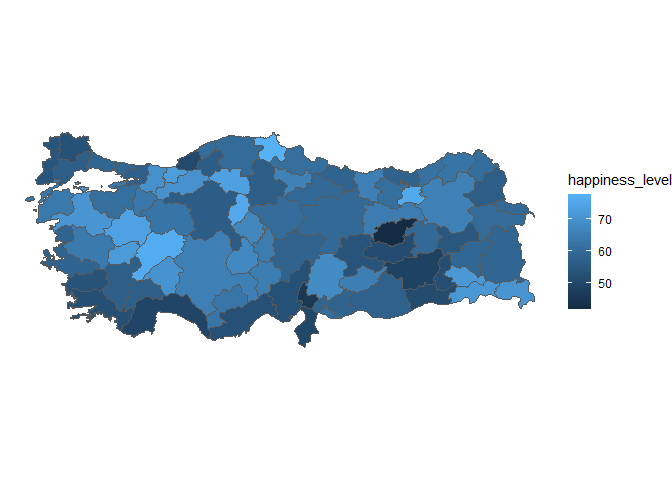

# TRmaps <a href='https://github.com/htastan/TRmaps'></a>

The purpose of this package is to provide geo-spatial data sets that are
needed to draw regional maps of Turkey at four levels:

-   NUTS-Level 1: Broad geographical regions (there are 12)

-   NUTS-Level 2: Geographical sub-regions (there are 26)

-   NUTS-Level 3: Provinces (there are 81 as of 2021, these are also the
    largest administrative units)

-   District level: there are 973 districts as of 2021

## Installation

The development version can be installed from
[GitHub](https://github.com/) using

``` r
# devtools is required
# install.packages("devtools")
devtools::install_github("htastan/TRmaps")
```

## Basic Usage

### NUTS-1

``` r
library(TRmaps)
library(tidyverse)
#> -- Attaching packages --------------------------------------- tidyverse 1.3.1 --
#> v ggplot2 3.3.5     v purrr   0.3.4
#> v tibble  3.1.2     v dplyr   1.0.6
#> v tidyr   1.1.3     v stringr 1.4.0
#> v readr   1.4.0     v forcats 0.5.1
#> -- Conflicts ------------------------------------------ tidyverse_conflicts() --
#> x dplyr::filter() masks stats::filter()
#> x dplyr::lag()    masks stats::lag()
library(sf)
#> Linking to GEOS 3.9.0, GDAL 3.2.1, PROJ 7.2.1
```

``` r
data("tr_nuts1")
tr_nuts1
#> Simple feature collection with 12 features and 2 fields
#> Geometry type: MULTIPOLYGON
#> Dimension:     XY
#> Bounding box:  xmin: 25.66521 ymin: 35.81946 xmax: 44.82037 ymax: 42.10502
#> Geodetic CRS:  WGS 84
#> First 10 features:
#>           NUTS1_name NUTS1_code                       geometry
#> 1     Bati Karadeniz        TR8 MULTIPOLYGON (((35.5137 41....
#> 2           Istanbul        TR1 MULTIPOLYGON (((29.86563 41...
#> 3       Bati Marmara        TR2 MULTIPOLYGON (((28.16478 40...
#> 4  Kuzeydogu Anadolu        TRA MULTIPOLYGON (((43.46964 41...
#> 5     Dogu Karadeniz        TR9 MULTIPOLYGON (((42.51517 41...
#> 6  Güneydogu Anadolu        TRC MULTIPOLYGON (((41.38055 38...
#> 7                Ege        TR3 MULTIPOLYGON (((29.74218 39...
#> 8       Bati Anadolu        TR5 MULTIPOLYGON (((32.55482 40...
#> 9            Akdeniz        TR6 MULTIPOLYGON (((37.63867 37...
#> 10      Dogu Marmara        TR4 MULTIPOLYGON (((30.35469 41...
```

To draw a simple map, run the following code chunk:

``` r
ggplot(tr_nuts1) + 
  geom_sf()
```


``` r
ggplot(tr_nuts1) + 
  geom_sf(mapping = aes(fill = NUTS1_name))
```


### NUTS-2

``` r
ggplot(tr_nuts2) + 
  geom_sf()
```


### NUTS-3

``` r
ggplot(tr_nuts3) + 
  geom_sf()
```


### District level

``` r
ggplot(tr_ilce) + 
  geom_sf()
```


## Merging with your data set

### NUTS-3 example

``` r
# load example data set 
data("trdata2015")
# select happiness level and province key
tr_happiness <- trdata2015 %>% 
  select(province, happiness_level)
# merge with geo-spatial data 
tr_happiness2 <- left_join(tr_nuts3, tr_happiness, by = c("name_tr" = "province"))
ggplot(tr_happiness2) + 
  geom_sf(aes(fill = happiness_level)) +
  theme_void()
```



``` r
# fixed and interactive maps using {tmap} package
library(tmap)
tmap_mode("plot")
#> tmap mode set to plotting
tm_shape(tr_happiness2) +
  tm_polygons("happiness_level") +
  tm_layout(legend.outside = TRUE)
```


``` r
# uncomment for interactive map
# tmap_mode("view")
# tm_shape(tr_happiness2) +
#  tm_polygons("happiness_level")
```

### District-level example

``` r
# load population data 
data("trpopdata_ilce")
# map of 2019 district population
ilce_pop_2019 <- trpopdata_ilce %>% 
  filter(year==2019) %>% 
  select(no, pop) 

ilce_pop_2019_comb <- left_join(tr_ilce, ilce_pop_2019, by = c("tuik_no" = "no"))
# compute population density
ilce_pop_2019_comb <- ilce_pop_2019_comb %>% 
  mutate(area = st_area(ilce_pop_2019_comb)) %>% 
  mutate(density = pop/(Shape_Area*10000), 
         logdensity = log(density))
```

``` r
# istanbul 
ilce_pop_2019_comb %>% filter(adm1 == "TUR034") %>%
  ggplot() +
  geom_sf(aes(fill = density)) + 
  scale_fill_viridis_c(trans = "log10", 
                       breaks=c(0,100,1000,10000)) +
  labs(fill = "Nüfus Yoğunluğu") + 
  theme_void()
```


``` r
# use tmap package 
# tmap_mode("view")
tm_shape(ilce_pop_2019_comb) +
tm_polygons(c("density"), style = "log10_pretty",
title = "Nüfus yoğunluğu (log)") +
  tm_layout(legend.outside = TRUE)
```


